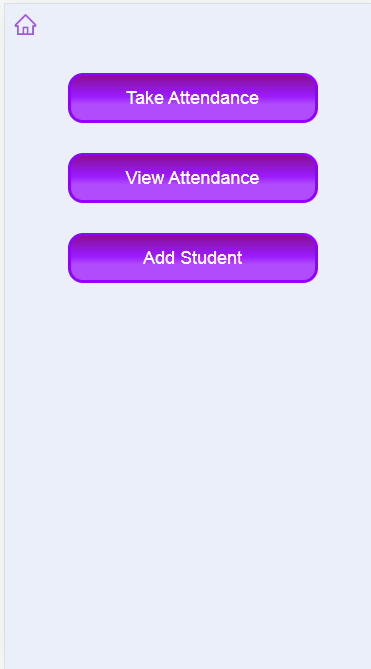

# School Attendance system

Hi, This web app is used to take, view and manage attendance of students

**Features**:-
 - Add Student
 - Class and date wise attendance
 - View monthly attendance record of students and student details by student roll no.

# Screenshots
**Dashboard**\
\
**Take Attendance**\
selectClass > attendancePage > StudentList\
\
\
\
**View Attendance**\
viewAttendence > attendenceRecord\
\
\
**Add Student**\

>Note:- This web app is designed to run on mobile devices so please view in mobile view in the browser

to run the web app use command `npm run dev`\
Open [http://localhost:3000](http://localhost:3000) with your browser to see the result
